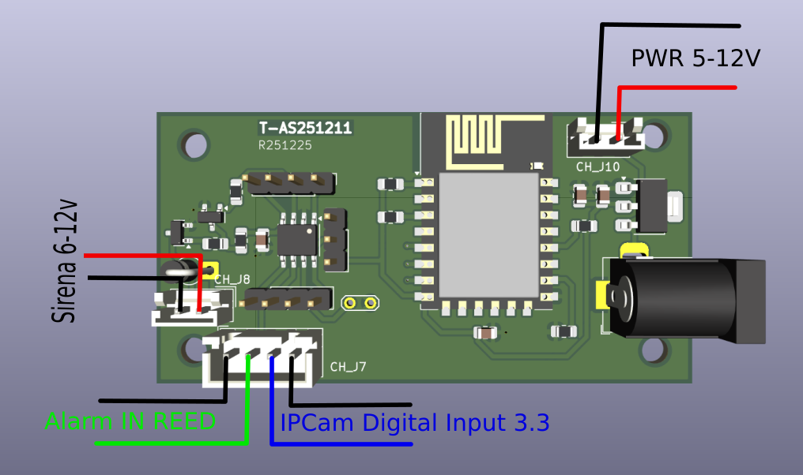

#	Tasmota  Alarm Camera and Sirena Control

Это бюджетный контрольный блок позволяющий подключать сирену и IPC-камеру используя контакт DI.
 
питание 5v - 12v.
подключение к внешней сирене с уровнем текущего напряжения питания.
Подключение управаления камерой к сигналу DI с уровнем 3.3v. 

###	Конфигурация tasmota

Конфигурация имеет следующие элементы:

-	relay 1 - включение слежение за датчиком. Используется для активации слежения сигнала от датчика (например Reeed-contact). Возможность активировать через панель управления устройсвом, через web-интерфейс вызовом `http://<device_ip>/cm?cmnd=power1%201` для активации и `http://<device ip>/cm?cmnd=power1%200` для деактивации, либо посредсвом отправки mqtt сообщения в топик `cmnd/tasmota_<DeviceID>/POWER1` сообщений `ON` или `OFF`.

-	relay 2 - принудительная активация сирены. Если используется сирена, то ее активацию можно произвести программно через панель управления устройсвом, через web-интерфейс вызовом `http://<device ip>/cm?cmnd=power2%201` для активации и `http://<device ip>/cm?cmnd=power2%200` для деактивации, либо посредсвом отправки mqtt сообщения в топик `cmnd/tasmota_<DeviceID>/POWER2` сообщений `ON` или `OFF`. Если используется камера, то сигнал записи данных будет подаваться автоматически.

-	switch 3 - показывает текущее состояние датчика. Его можно проверить по web-интерфейс с запросом `http://<device_ip>/cm?cmnd=status%2010` или через mqtt отправкой в топик `cmnd/tasmota_502044/Status` сообщения `10`. 

	`<device_ip>` - это уникальный адрес устройства в вашей сети.

	`<DeviceID>` - уникальный идентификатор устройства.

