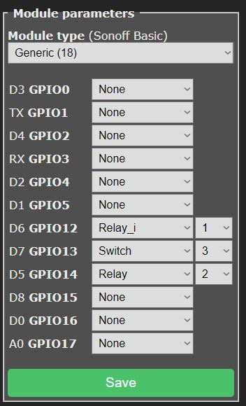

# Tasmota Alarm Camera and Sirena Control

This is a budget control unit that allows connecting a siren and an IPC camera using the DI contact.  
Power supply: 5V – 12V.  
Connection to an external siren with voltage level matching the power supply.  
Camera control connection to the DI signal at 3.3V level.

### Tasmota Configuration

The configuration includes the following elements:

- **Relay1** — enables monitoring of the sensor.  
  Used to activate tracking of the sensor signal (e.g., Reed contact).  
  Can be activated via the device control panel, through the web interface with the request  
  `http://<device_ip>/cm?cmnd=power1%201` (to turn on) and  
  `http://<device_ip>/cm?cmnd=power1%200` (to turn off),  
  or by sending an MQTT message to the topic  
  `cmnd/tasmota_<DeviceID>/POWER1` with payload `ON` or `OFF`.

- **Relay2** — forced siren activation.  
  If a siren is used, its activation can be triggered programmatically via the device control panel,  
  through the web interface with the request  
  `http://<device_ip>/cm?cmnd=power2%201` (to turn on) and  
  `http://<device_ip>/cm?cmnd=power2%200` (to turn off),  
  or by sending an MQTT message to the topic  
  `cmnd/tasmota_<DeviceID>/POWER2` with payload `ON` or `OFF`.  
  If a camera is used, the recording trigger signal will be sent automatically.

- **Switch3** — shows the current state of the sensor.  
  Can be checked via the web interface with the request  
  `http://<device_ip>/cm?cmnd=status%2010`,  
  or through MQTT by sending the message `10` to the topic  
  `cmnd/tasmota_<DeviceID>/Status`.

`<device_ip>` — the unique IP address of the device in your network.  
`<DeviceID>` — the unique identifier of the device.
### Curcuit

[see](circuit/kicad/Esp8266-DomoticzAlarm-2B/README.md)

### Plugin for Domoticz

[see](scripts/Domoticz/plugins/TasmotaMQTTAlarmCtrl/README.md)
